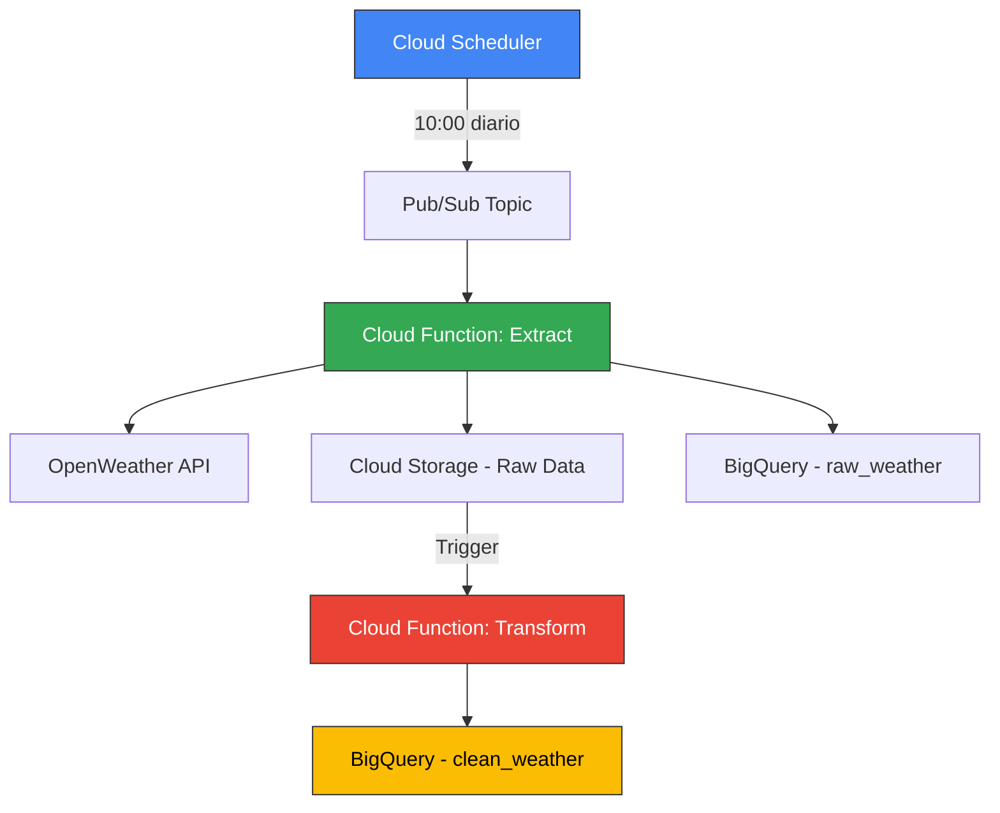

# ⛅ Weather ETL Pipeline - GCP Data Engineering Project

[](https://www.python.org/)
[](https://cloud.google.com/)
[](https://terraform.io/)
[](LICENSE)

> **Pipeline ETL serverless en Google Cloud Platform para análisis de datos meteorológicos en tiempo real**

Un proyecto completo de ingeniería de datos que demuestra la implementación de un pipeline ETL moderno usando servicios cloud nativos, infraestructura como código y mejores prácticas de DevOps.

---

## 🎯 **Objetivo del Proyecto**

Desarrollar un pipeline ETL robusto y escalable que:
- Extraiga datos meteorológicos de múltiples ciudades latinoamericanas
- Procese y transforme los datos para análisis
- Automatice la ejecución diaria sin intervención manual
- Implemente infraestructura versionada y reproducible

---

## 🏗️ **Arquitectura del Sistema**



### **Componentes Principales**

| Servicio | Función | Tecnología |
|----------|---------|------------|
| **Cloud Scheduler** | Automatización temporal | Cron Jobs |
| **Pub/Sub** | Mensajería asíncrona | Event-driven |
| **Cloud Functions** | Procesamiento serverless | Python 3.9+ |
| **Cloud Storage** | Data Lake (raw data) | JSON files |
| **BigQuery** | Data Warehouse | SQL analytics |
| **Terraform** | Infrastructure as Code | HCL |

---

## 📊 **Datos Procesados**

### **Ciudades Monitoreadas**
- 🇨🇱 Santiago, Chile
- 🇦🇷 Buenos Aires, Argentina
- 🇵🇪 Lima, Perú
- 🇨🇴 Bogotá, Colombia
- 🇪🇨 Quito, Ecuador
- 🇺🇾 Montevideo, Uruguay

### **Métricas Capturadas**
```json
{
  "city": "Santiago",
  "temperature": 22.5,
  "humidity": 65,
  "pressure": 1013.25,
  "wind_speed": 3.2,
  "weather_condition": "Clear",
  "timestamp": "2025-07-23T10:00:00Z"
}
```

---

## 🚀 **Flujo de Datos Detallado**

### **1. Extracción (Extract Function)**
```python
# Proceso de extracción diario
├── Conexión a OpenWeather API
├── Iteración por ciudades configuradas
├── Validación y limpieza inicial
├── Almacenamiento en Cloud Storage (raw/YYYY-MM-DD/)
└── Inserción en BigQuery (raw_weather table)
```

### **2. Transformación (Transform Function)**
```python
# Proceso de transformación
├── Lectura desde raw_weather
├── Limpieza y normalización de datos
├── Cálculo de métricas derivadas
├── Validación de calidad de datos
└── Inserción en clean_weather table
```

### **3. Automatización**
- ⏰ **Frecuencia**: Diaria a las 10:00 AM (UTC-3)
- 🔄 **Tolerancia a fallos**: Reintentos automáticos
- 📊 **Monitoreo**: Logs centralizados en Cloud Logging

---

## 📁 **Estructura del Proyecto**

```
weather-etl-pipeline/
├── 📂 .github/workflows/          # CI/CD con GitHub Actions
│   └── deploy.yml
├── 📂 extract_function/           # Función de extracción
│   ├── main.py
│   ├── requirements.txt
│   └── config.py
├── 📂 transform_function/         # Función de transformación
│   ├── main.py
│   ├── requirements.txt
│   └── utils.py
├── 📂 terraform/                  # Infrastructure as Code
│   ├── main.tf
│   ├── variables.tf
│   ├── terraform.tfvars.example
│   ├── outputs.tf
│   └── versions.tf
├── 📂 tests/                      # Pruebas unitarias
│   ├── test_extract.py
│   └── test_transform.py
├── 📂 docs/                       # Documentación técnica
├── 📄 requirements.txt
├── 📄 .gitignore
├── 📄 LICENSE
└── 📄 README.md
```

---

## ⚙️ **Instalación y Despliegue**

### **Prerrequisitos**
```bash
# Herramientas necesarias
- Google Cloud SDK (gcloud)
- Terraform >= 1.0
- Python 3.9+
- Git
```

### **1. Configuración Inicial**
```bash
# Clonar el repositorio
git clone https://github.com/franco-ahumada/weather-etl-pipeline.git
cd weather-etl-pipeline

# Configurar variables de entorno
cp terraform/terraform.tfvars.example terraform/terraform.tfvars
# Editar terraform.tfvars con tus valores
```

### **2. Despliegue con Terraform**
```bash
cd terraform

# Inicializar Terraform
terraform init

# Planificar cambios
terraform plan

# Aplicar infraestructura
terraform apply
```

### **3. Configuración de API Keys**
```bash
# Configurar OpenWeather API Key
gcloud functions deploy weather-extract \
  --set-env-vars OPENWEATHER_API_KEY=your_api_key_here
```

---

## 📈 **Casos de Uso**

### **Para Data Engineers**
- Implementación de pipeline ETL serverless
- Uso de servicios cloud nativos
- Infrastructure as Code con Terraform
- Event-driven architecture

### **Para Data Analysts**
- Datos meteorológicos históricos estructurados
- Análisis de tendencias climáticas regionales
- Dashboards y visualizaciones
- APIs para consumo de datos

### **Para DevOps Engineers**
- CI/CD con GitHub Actions
- Monitoreo y alertas
- Gestión de secretos
- Automatización de despliegues

---

## 📊 **Consultas de Ejemplo**

### **Temperatura promedio por ciudad (últimos 30 días)**
```sql
SELECT 
  city,
  AVG(temperature) as avg_temp,
  COUNT(*) as records
FROM `your-project.weather_analytics.clean_weather`
WHERE date >= DATE_SUB(CURRENT_DATE(), INTERVAL 30 DAY)
GROUP BY city
ORDER BY avg_temp DESC;
```

### **Ciudades con mayor variabilidad térmica**
```sql
SELECT 
  city,
  STDDEV(temperature) as temp_variance,
  MIN(temperature) as min_temp,
  MAX(temperature) as max_temp
FROM `your-project.weather_analytics.clean_weather`
WHERE date >= DATE_SUB(CURRENT_DATE(), INTERVAL 7 DAY)
GROUP BY city
ORDER BY temp_variance DESC;
```

---

## 🔧 **Configuración Avanzada**

<details>
<summary><strong>Variables de Terraform</strong></summary>

```hcl
# terraform/terraform.tfvars
project_id = "your-gcp-project-id"
region = "us-central1"
bucket_name = "your-weather-data-bucket"
dataset_id = "weather_analytics"
api_key_secret = "openweather-api-key"

# Ciudades a monitorear
cities = [
  "Santiago,CL",
  "Buenos Aires,AR",
  "Lima,PE",
  "Bogotá,CO"
]
```
</details>

<details>
<summary><strong>Monitoreo y Alertas</strong></summary>

```yaml
# .github/workflows/monitoring.yml
name: Pipeline Health Check
on:
  schedule:
    - cron: '0 11 * * *'  # Verificar 1 hora después del ETL

jobs:
  health_check:
    runs-on: ubuntu-latest
    steps:
      - name: Check BigQuery Data Freshness
        run: |
          # Script para verificar que los datos del día están presentes
```
</details>

---

## 🚨 **Troubleshooting**

### **Errores Comunes**

| Error | Causa | Solución |
|-------|-------|----------|
| `403 Forbidden` | API Key inválida | Verificar OPENWEATHER_API_KEY |
| `409 Conflict` | Recurso ya existe | Usar `terraform import` |
| `Timeout` | Función excede 540s | Optimizar consultas BigQuery |

### **Comandos de Diagnóstico**
```bash
# Ver logs de Cloud Functions
gcloud functions logs read weather-extract --limit 50

# Verificar estado de Pub/Sub
gcloud pubsub topics list

# Validar datos en BigQuery
bq query --use_legacy_sql=false 'SELECT COUNT(*) FROM weather_analytics.clean_weather WHERE date = CURRENT_DATE()'
```

---

## 🎯 **Próximas Mejoras**

- [ ] **Dashboard en Looker Studio** para visualización de datos
- [ ] **Alertas automáticas** para condiciones meteorológicas extremas
- [ ] **ML Pipeline** para predicción del clima
- [ ] **API REST** para consumo externo de datos
- [ ] **Tests de integración** con pytest
- [ ] **Documentación OpenAPI** para endpoints

---

## 🤝 **Contribuciones**

Las contribuciones son bienvenidas! Por favor:

1. Fork el proyecto
2. Crea una rama para tu feature (`git checkout -b feature/nueva-funcionalidad`)
3. Commit tus cambios (`git commit -m 'Agregar nueva funcionalidad'`)
4. Push a la rama (`git push origin feature/nueva-funcionalidad`)
5. Abre un Pull Request

---

## 📄 **Licencia**

Este proyecto está bajo la Licencia MIT. Ver el archivo [LICENSE](LICENSE) para más detalles.

---

## 👨‍💻 **Autor**

**Franco Ahumada** - *Data Engineer*

[](https://linkedin.com/in/franco-ahumada)
[](https://github.com/franco-ahumada)
[](https://franco-ahumada.dev)

---

## ⭐ **Stack Tecnológico**


---

<div align="center">
  <strong>🌟 Si este proyecto te resulta útil, no olvides darle una estrella! 🌟</strong>
</div>